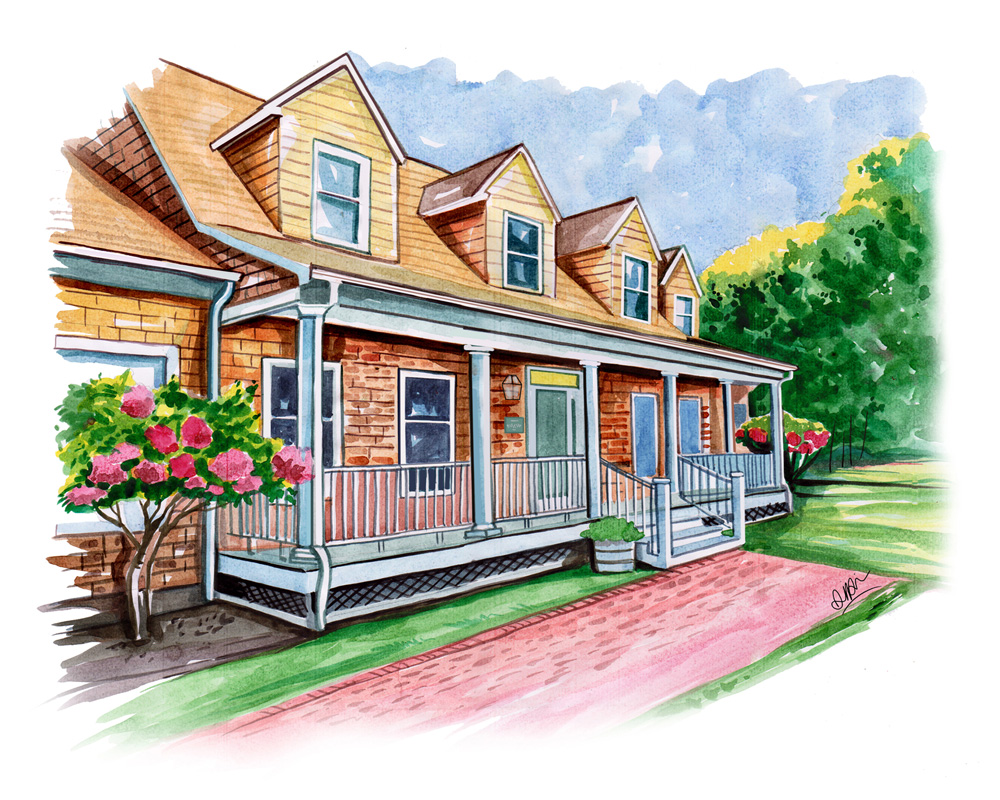
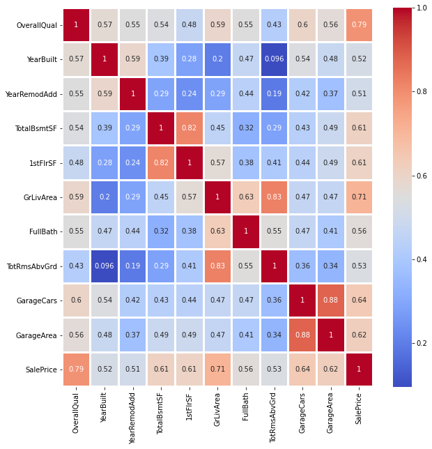

# Exploratory Data Analysis and Sale price prediction of Houses

The project consists of a dataset of 1460 unique houses and their 81 features such as their area, porch size, sunlight exposure, whether or not there is a bathtub and fireplace and much more which will be analysed to predict selling price of another 1459 houses. Initially EDA has been performed to check relation of sale price with all the features and then a clean up the data to fill up the null values and then different algorithms have been used to find their accuracy in prediction. The Dataset used is the Ames Housing dataset from Kaggle.
## A correlation heatmap of sinificant features found in the dataset

